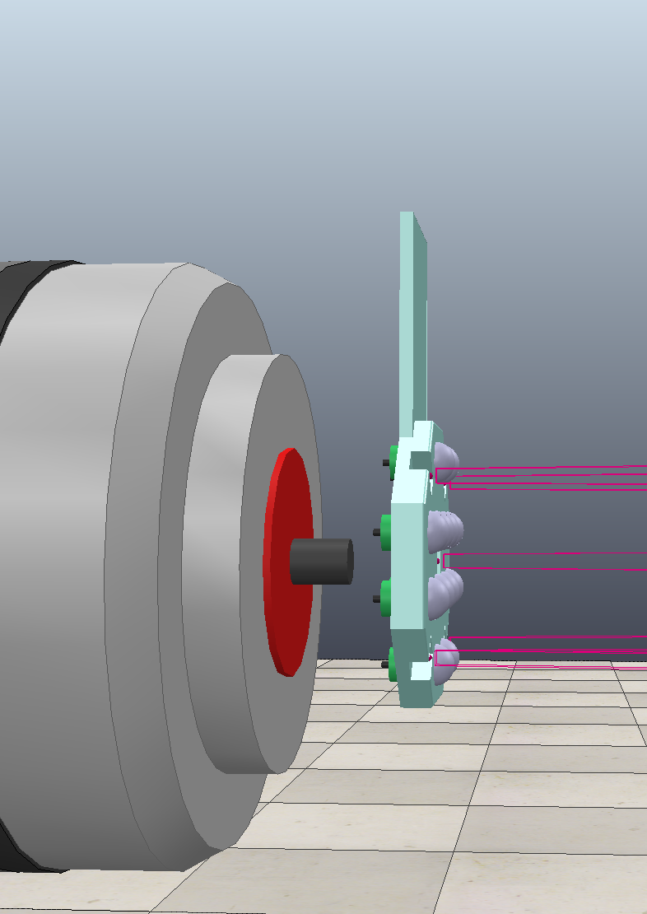
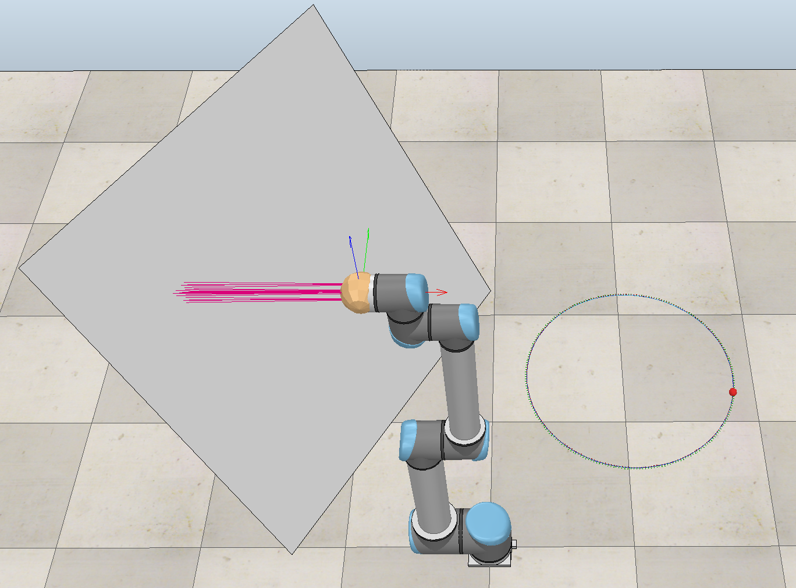
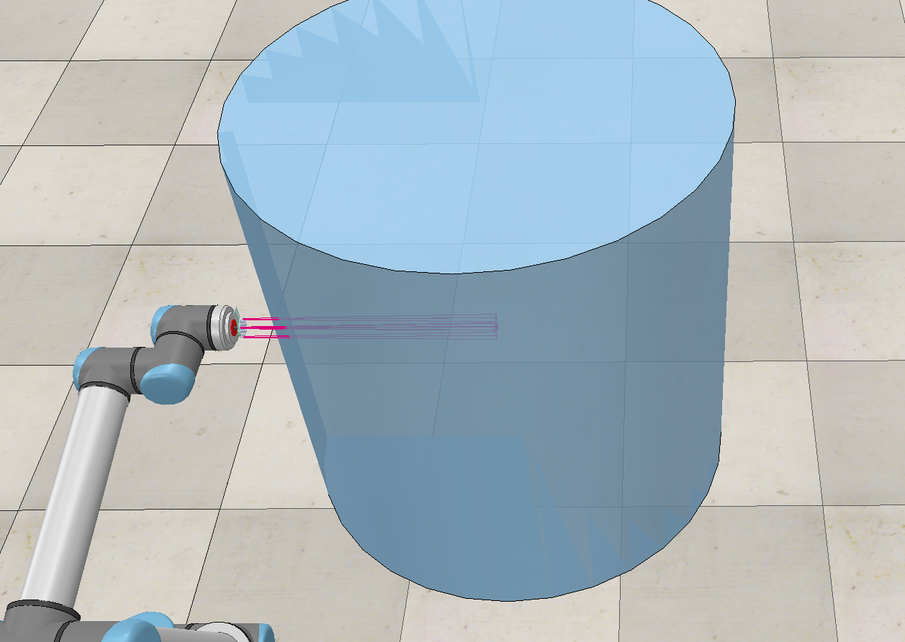
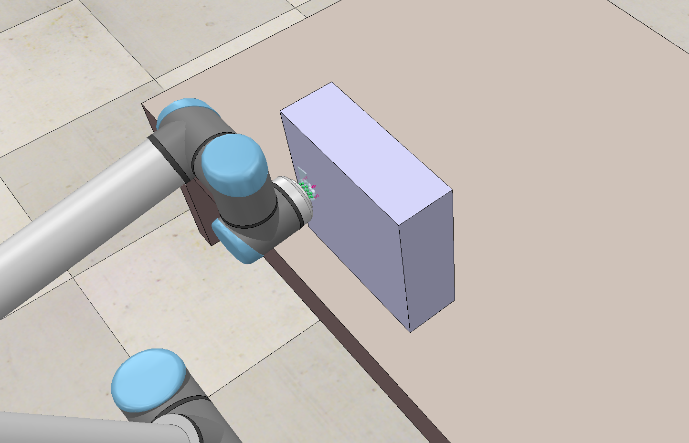
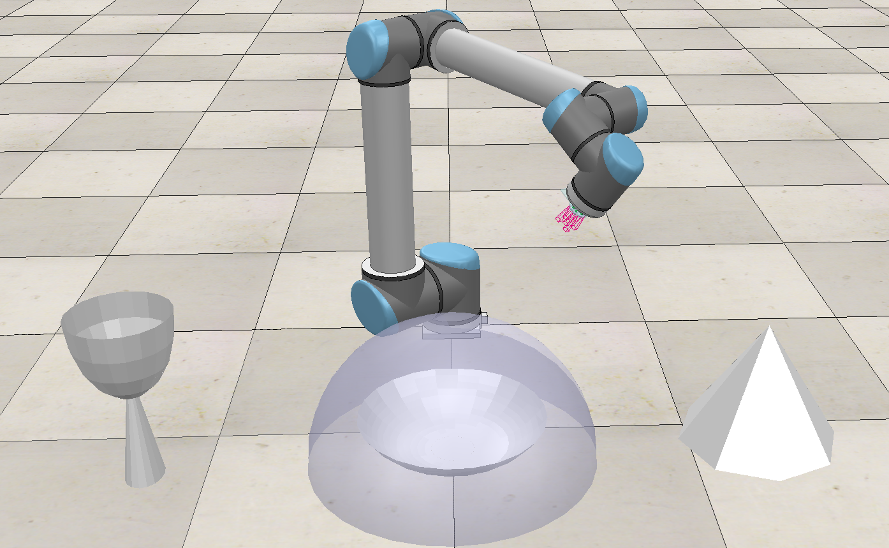

# URX_Coppeliasim_servo
Completed tactile servo control of the ur5 robot arm based on vrep version 4.1, including a custom tactile sensor array

- .ttt files are model files. You can modify the model in the ttt file, but you need to ensure that the name in the code should be consistent with the modified name.

- sim.py simConst.py and remoteApi.dll are aet here for interacting with vrep, with these files,you can call "sim.xxx" .etc as APIs.
- 
  ## sensor.ttt
  
  ## plane_demo
  plane_demo is a simple demonstration of parallel servo control.
  
  
  ## push
  Using proximity sensing, aim at a cylindrical object and push it to move forward in a straight line.
  
  
  ## push for affordance
  Try pushing one by one, plan the displacement according to the tactile image feedback from the tactile sensor array, and gradually find the best pushing position for objects with uneven mass distribution.
  
  
  ## generate pointcloud
  In a non-contact state, parallel servo control is used to randomly explore the surface of the object to record the point cloud, and then the relevant point cloud deep learning method (pointnet++) is used to identify the object. The object model comes from the modelNet40 dataset
  
  
